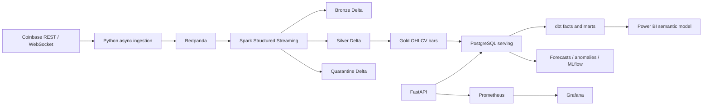
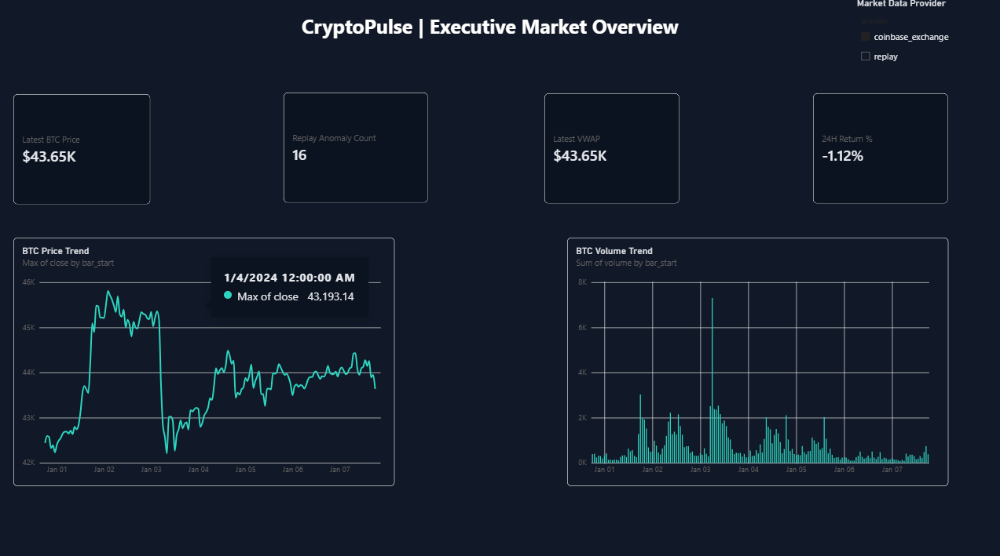
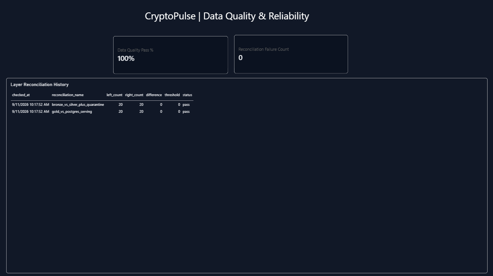
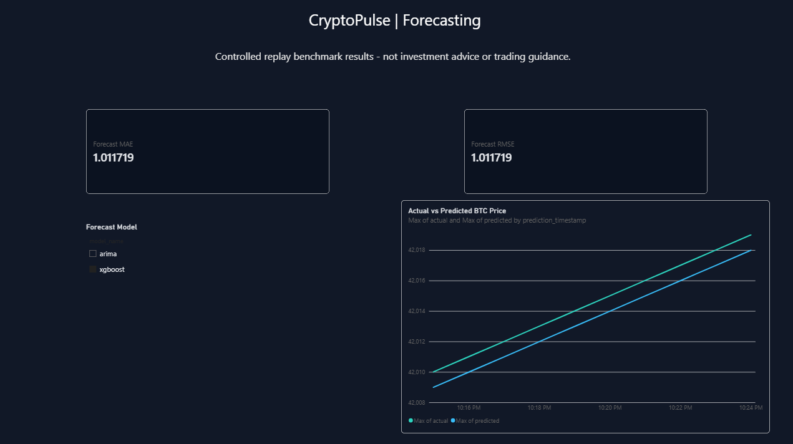
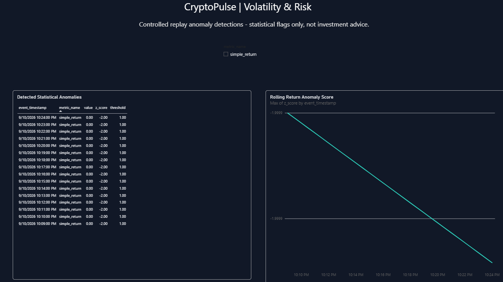

# CryptoPulse: Bitcoin Market Intelligence Platform

CryptoPulse is a local-first data engineering and analytics capstone for Bitcoin/USD market data.
It demonstrates asynchronous ingestion, Redpanda, Delta Bronze/Silver/Gold processing, dbt
analytics, data quality/reconciliation, forecasting experiments, anomaly detection, a FastAPI
serving layer, Power BI semantic-model assets, and optional Microsoft Fabric mapping.

It is designed with production-oriented patterns, but no unsupported production-scale, uptime,
throughput, trading-performance, or profitability claim is made.

## Architecture



See [architecture](docs/ARCHITECTURE.md), [lineage](docs/DATA_LINEAGE.md), and the current
[status](STATUS.md).

## Quick start

Prerequisites: Docker Desktop, Python 3.11 to 3.13, and Java 17 for host-run Spark tests. Copy the
example environment file and replace placeholder object-store values before starting containers.

```powershell
copy .env.example .env
py -3.13 -m pip install -e ".[dev,analytics]"
docker compose up -d
py -3.13 -m pytest tests/unit -q
```

Local services:

| Service | URL |
|---|---|
| API documentation | http://localhost:8000/docs |
| Prometheus | http://localhost:9090 |
| Grafana | http://localhost:3000 |
| MLflow | http://localhost:5000 |
| MinIO console | http://localhost:9001 |

## Common commands

```powershell
make backfill       # show historical backfill command help
make stream         # run Spark Structured Streaming in Docker
make replay         # publish controlled replay events
make load-gold      # upsert finalized Gold bars to PostgreSQL
make reconcile      # compare persisted layers
make dbt            # dbt build in Docker
make anomalies      # run rolling z-score anomaly detection
make benchmark      # create a measured local API latency artifact
make test
make lint
```

To load a finite Coinbase REST history into immutable Bronze storage and the local PostgreSQL
serving layer used by dbt and Power BI, run a timestamp-bounded backfill:

```powershell
py -3.13 -m cryptopulse.ingestion.backfill `
  --start 2024-01-01T00:00:00Z --end 2024-01-08T00:00:00Z `
  --symbol BTC-USD --load-serving
make dbt
```

`--load-serving` is intentionally explicit: the validated source OHLCV candles remain in Bronze
for replay/audit and are also upserted idempotently to the local historical serving grain. It does
not replace the continuously running Spark streaming path.

## Data design and quality

Bronze preserves raw source events; Silver validates, normalizes, deduplicates, and quarantines
invalid records; Gold produces event-time OHLCV/VWAP bars. Pydantic validates contracts at ingress,
Spark enforces quality during transformation, dbt tests analytics models, and reconciliation outcomes
are persisted for reporting. Details: [data contract](docs/DATA_CONTRACT.md),
[data dictionary](docs/DATA_DICTIONARY.md), and [governance](docs/GOVERNANCE.md).

## Forecasting

Forecasting uses chronological expanding-window evaluation with persistence, moving-average, ARIMA,
and XGBoost benchmarks. Results are persisted with model/training provenance and tracked locally in
MLflow. This is an engineering benchmark framework, not a trading system.

## Power BI and Fabric

Power BI source assets, DAX measures, theme, semantic-model relationship design, and manual PBIP
steps are in [powerbi/](powerbi/README.md). A PBIX is intentionally not fabricated. The optional
Fabric mapping is isolated in [fabric/](fabric/README.md); it is not required for local execution.

## Screenshots

The following report pages were built manually in Power BI Desktop against the local PostgreSQL
analytics layer. Forecasting and anomaly visuals explicitly identify controlled replay data where
applicable; they are not investment advice.

| Executive market overview | Data quality and reliability |
| --- | --- |
|  |  |

| Forecasting | Volatility and risk |
| --- | --- |
|  |  |

## Reliability and testing

The project contains unit tests, Docker validation, dbt parse/build coverage, a GitHub Actions
workflow, controlled replay, and documented recovery experiments. Runbooks and actual measurements
are distinguished from planned tests: [failure recovery](docs/FAILURE_RECOVERY.md) and
[benchmark artifacts](artifacts/benchmarks/).

## Repository map

- `src/cryptopulse/` - ingestion, contracts, Spark, serving API, forecasting, and anomalies
- `dbt/` - staging, intermediate, dimensions, facts, and marts
- `airflow/` - finite batch workflow definitions
- `infra/` - Docker images, Prometheus, and Grafana provisioning
- `powerbi/` - semantic-model and report assets
- `fabric/` - optional Fabric architecture and KQL
- `docs/` - architecture, governance, decisions, runbooks, and case study

## Evidence and next work

One real local API benchmark artifact exists under `artifacts/benchmarks/`; it is a 25-request
localhost health measurement, not an end-to-end throughput result. Read [STATUS.md](STATUS.md) for
verified behavior, active work, manual steps, and the continuation point.

## Author

**Abhishek Rithik Origanti**  
Email: [abhishekoriganti@gmail.com](mailto:abhishekoriganti@gmail.com)  
GitHub: [github.com/abhioriganti](https://github.com/abhioriganti)
