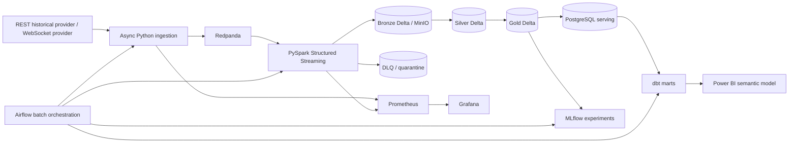

# Architecture

CryptoPulse has a mandatory local open-source deployment mode and an optional Microsoft Fabric mapping. The permanent stream is independently supervised; Airflow schedules finite batch and maintenance workflows only.

## Local components

Redpanda is the Kafka-compatible event broker. MinIO provides S3-compatible storage for Delta/Parquet data. PostgreSQL is the serving and dbt target. MLflow tracks local model experiments. Prometheus and Grafana support observability.

## Data layer responsibilities

| Layer | Responsibility | Grain |
|---|---|---|
| Bronze | Immutable source event and raw payload preservation | Source event |
| Silver | Validated, normalized, deterministic-deduplicated events | Canonical market event |
| Gold | Curated facts, dimensions, aggregates, quality and forecast records | Documented per mart |

## Deduplication and late events

Silver uses `event_id` when present; otherwise it derives a stable key from provider, symbol, event type, event timestamp, interval, and source sequence. Streaming jobs use event-time watermarks; events beyond the configured lateness policy are recorded with quality metadata rather than silently dropped.

## Fabric mapping

The optional Fabric design maps producer events to Eventstream, Eventhouse/KQL, and Lakehouse/OneLake Delta tables. Curated models are served through a Power BI semantic model, using Direct Lake where appropriate. See `fabric/README.md` when that phase is implemented.
