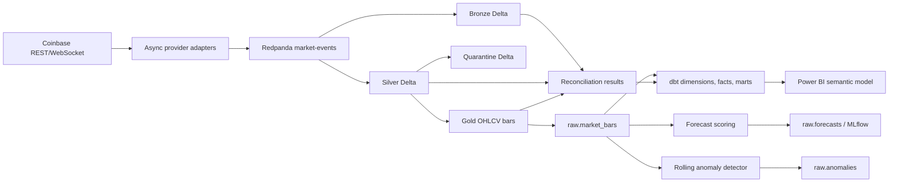

# Data lineage

## Ownership

| Asset | Owner role | Change control |
|---|---|---|
| Event contract | Data engineering | Versioned JSON Schema and Pydantic tests |
| Silver rules/checkpoints | Streaming engineering | Code review plus Spark/replay validation |
| dbt marts | Analytics engineering | dbt parse/build/tests |
| Forecast/anomaly outputs | ML engineering | time-ordered evaluation and persisted provenance |
| Semantic model/DAX | BI engineering | PBIP/TMDL review and Desktop validation |
