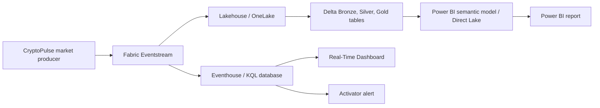

# Optional Microsoft Fabric deployment

Fabric is an optional enterprise deployment path. It is not required for the local CryptoPulse
platform, Docker Compose, Spark processing, or Power BI Desktop report development.

## Target mapping

| Local component | Fabric equivalent | Purpose |
|---|---|---|
| Coinbase ingestion + Redpanda | producer + Eventstream | Event intake and routing |
| MinIO Delta lakehouse | Lakehouse / OneLake | Bronze, Silver, Gold Delta persistence |
| Spark Structured Streaming | Fabric Spark notebook/job | typed stream processing and aggregations |
| PostgreSQL + dbt serving marts | Lakehouse SQL endpoint / Warehouse | curated SQL serving layer |
| Prometheus/Grafana | Fabric monitoring + Azure Monitor where applicable | platform observability |
| Local MLflow | MLflow tracking in Fabric Data Science | experiment tracking |
| Power BI Import model | Direct Lake semantic model where appropriate | BI consumption |

## Deployment sequence

1. Create a Fabric workspace and assign least-privilege workspace roles.
2. Create a Lakehouse and Eventhouse/KQL database. Store environment names and connection IDs in
   a deployment-specific secret store; do not copy local `.env` values into repository files.
3. Create an Eventstream with an approved producer source. Route raw events to both the Eventhouse
   and Lakehouse Bronze target.
4. Deploy the canonical event contract from `schemas/market_event.v1.json`. Add compatibility
   checks before accepting a new schema version.
5. Port the local Bronze/Silver/Gold transformations into versioned Fabric notebooks or Spark jobs.
   Preserve Delta table grain, deterministic event key logic, watermarks, and quarantine handling.
6. Create Gold tables, then a Direct Lake semantic model built from the same star schema described
   in `../powerbi/semantic_model/RELATIONSHIPS.md`.
7. Import the source-controlled theme and measures after validating TMDL against the target
   Desktop/Fabric release. Publish the report to the workspace.
8. Configure Eventhouse KQL querysets and the Real-Time Dashboard from `kql/` queries. Add
   Activator alerts only after observing normal baseline behavior.

## Fabric services and intent

- **Real-Time Hub:** discover Eventstream and event-derived data products.
- **Eventhouse/KQL:** low-latency operational investigation of incoming market events.
- **Lakehouse/OneLake:** governed Delta Lake storage for replayable Bronze/Silver/Gold data.
- **Direct Lake:** semantic model consumption where the Gold model resides in Fabric.
- **KQL Querysets:** versioned operational and data-quality exploration.
- **Activator:** optional alerting on freshness, quarantine rate, or pipeline failure conditions.

## Guardrails

- Keep API keys and Fabric tokens in managed credentials or secret stores.
- Use separate development and production workspaces.
- Do not send investment recommendations or automated trading decisions through Fabric alerts.
- Treat the local pipeline as the reproducible baseline; test Fabric deployment independently before
  claiming equivalent latency, volume, or reliability characteristics.
