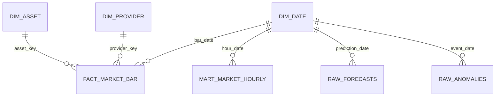

# CryptoPulse semantic-model relationships

## Star schema

| From | Cardinality | To | Active relationship |
|---|---|---|---|
| `Dim Asset[asset_key]` | one-to-many | `Fact Market Bar[asset_key]` | Yes, single direction |
| `Dim Provider[provider_key]` | one-to-many | `Fact Market Bar[provider_key]` | Yes, single direction |
| `Dim Date[date]` | one-to-many | `Fact Market Bar[date_key]` | Yes, single direction |
| `Dim Date[date]` | one-to-many | `Mart Market Hourly[hour_date]` | Yes, single direction |
| `Dim Date[date]` | one-to-many | `Forecasts[prediction_date]` | Inactive if a second forecast date is added |
| `Dim Date[date]` | one-to-many | `Anomalies[event_date]` | Yes, single direction |

Do not create bidirectional fact-to-fact relationships. Use measures for cross-fact metrics. Keep
`Fact Market Bar` at its stated grain; do not relate `Mart Market Hourly` directly to it.
